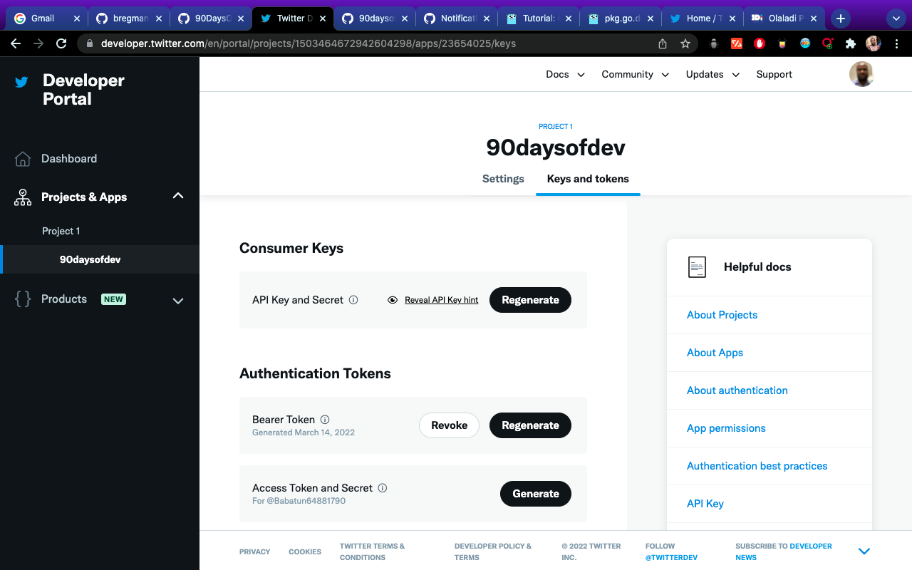

## Tweet your progress with our new App

On the final day of looking into this programming language, we have only just touched the surface here of the language but it is that start that I think we need to get interested and excited and want to dive more into it. 

Over the last few days, we have taken a small idea for an application and we have added functionality to it, in this session I want to take advantage of those packages we mentioned and create the functionality for our app to not only give you the update of your progress on screen but also send a tweet with the details of the challenge and your status.

## Adding the ability to tweet your progress 
The first thing we need to do is set up our developer API access with Twitter for this to work.

Head to the [Twitter Developer Platform](https://developer.twitter.com) and sign in with your Twitter handle and details. Once in you should see something like the below without the app that I already have created.



From here you may also want to request elevated access, this might take some time but it was very fast for me. 

Next, we should select Projects & Apps and create our App. Limits are depending on the account access you have, with essential you only have one app and one project and with elevated you can have 3 apps.


Give your application a name


You will be then given these API tokens, it is important that you save these somewhere secure. (I have since deleted this app) We will need these later with our Go Application.


Now we have our app created,(I did have to change my app name as the one in the screenshot above was already taken, these names need to be unique)


The keys that we gathered before are known as our consumer keys and we will also need our access token and secrets. We can gather this information using the "Keys & Tokens" tab. 


Ok, we are done in the Twitter developer portal for now. Make sure you keep your keys safe because we will need them later. 

## Go Twitter Bot 

Remember the code we are starting within our application as well [day13_example1](Go/day13_example1.go) but first, we need to check we have the correct code to make something tweet 

We now need to think about the code to get our output or message to Twitter in the form of a tweet. We are going to be using [go-twitter](https://github.com/dghubble/go-twitter) This is a Go client library for the Twitter API. 

To test this before putting this into our main application, I created a new directory in our `src` folder called go-twitter-bot, issued the `go mod init github.com/michaelcade/go-twitter-bot on the folder which then created a `go.mod` file and then we can start writing our new main.go and test this out. 

We now need those keys, tokens and secrets we gathered from the Twitter developer portal. We are going to set these in our environment variables. This will depend on the OS you are running: 

Windows
```
set CONSUMER_KEY
set CONSUMER_SECRET
set ACCESS_TOKEN
set ACCESS_TOKEN_SECRET
```

Linux / macOS
```
export CONSUMER_KEY
export CONSUMER_SECRET
export ACCESS_TOKEN
export ACCESS_TOKEN_SECRET
```
At this stage, you can take a look at [day13_example2](Go/day13_example2.go) at the code but you will see here that we are using a struct to define our keys, secrets and tokens.

We then have a `func` to parse those credentials and make that connection to the Twitter API

Then based on the success we will then send a tweet.

```
package main

import (
    // other imports
    "fmt"
    "log"
    "os"

    "github.com/dghubble/go-twitter/twitter"
    "github.com/dghubble/oauth1"
)

// Credentials stores all of our access/consumer tokens
// and secret keys needed for authentication against
// the twitter REST API.
type Credentials struct {
    ConsumerKey       string
    ConsumerSecret    string
    AccessToken       string
    AccessTokenSecret string
}

// getClient is a helper function that will return a twitter client
// that we can subsequently use to send tweets, or to stream new tweets
// this will take in a pointer to a Credential struct which will contain
// everything needed to authenticate and return a pointer to a twitter Client
// or an error
func getClient(creds *Credentials) (*twitter.Client, error) {
    // Pass in your consumer key (API Key) and your Consumer Secret (API Secret)
    config := oauth1.NewConfig(creds.ConsumerKey, creds.ConsumerSecret)
    // Pass in your Access Token and your Access Token Secret
    token := oauth1.NewToken(creds.AccessToken, creds.AccessTokenSecret)

    httpClient := config.Client(oauth1.NoContext, token)
    client := twitter.NewClient(httpClient)

    // Verify Credentials
    verifyParams := &twitter.AccountVerifyParams{
        SkipStatus:   twitter.Bool(true),
        IncludeEmail: twitter.Bool(true),
    }

    // we can retrieve the user and verify if the credentials
    // we have used successfully allow us to log in!
    user, _, err := client.Accounts.VerifyCredentials(verifyParams)
    if err != nil {
        return nil, err
    }

    log.Printf("User's ACCOUNT:\n%+v\n", user)
    return client, nil
}
func main() {
    fmt.Println("Go-Twitter Bot v0.01")
    creds := Credentials{
        AccessToken:       os.Getenv("ACCESS_TOKEN"),
        AccessTokenSecret: os.Getenv("ACCESS_TOKEN_SECRET"),
        ConsumerKey:       os.Getenv("CONSUMER_KEY"),
        ConsumerSecret:    os.Getenv("CONSUMER_SECRET"),
    }

    client, err := getClient(&creds)
    if err != nil {
        log.Println("Error getting Twitter Client")
        log.Println(err)
    }

    tweet, resp, err := client.Statuses.Update("A Test Tweet from the future, testing a #90DaysOfDevOps Program that tweets, tweet tweet", nil)
    if err != nil {
        log.Println(err)
    }
    log.Printf("%+v\n", resp)
    log.Printf("%+v\n", tweet)
}

```
The above will either give you an error based on what is happening or it will succeed and you will have a tweet sent with the message outlined in the code. 


**I will update the other part of the code soon..**

## Resources

- [StackOverflow 2021 Developer Survey](https://insights.stackoverflow.com/survey/2021)
- [Why we are choosing Golang to learn](https://www.youtube.com/watch?v=7pLqIIAqZD4&t=9s)
- [Jake Wright - Learn Go in 12 minutes](https://www.youtube.com/watch?v=C8LgvuEBraI&t=312s) 
- [Techworld with Nana - Golang full course - 3 hours 24 mins](https://www.youtube.com/watch?v=yyUHQIec83I) 
- [**NOT FREE** Nigel Poulton Pluralsight - Go Fundamentals - 3 hours 26 mins](https://www.pluralsight.com/courses/go-fundamentals) 
- [FreeCodeCamp -  Learn Go Programming - Golang Tutorial for Beginners](https://www.youtube.com/watch?v=YS4e4q9oBaU&t=1025s) 
- [Hitesh Choudhary - Complete playlist](https://www.youtube.com/playlist?list=PLRAV69dS1uWSR89FRQGZ6q9BR2b44Tr9N) 
- [A great repo full of all things DevOps & exercises](https://github.com/bregman-arie/devops-exercises)
- [GoByExample - Example based learning](https://gobyexample.com/)
- [go.dev/tour/list](https://go.dev/tour/list)
- [go.dev/learn](https://go.dev/learn/)