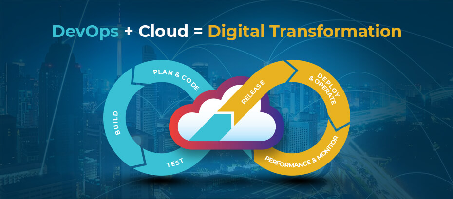

# The Big Picture: DevOps & The Cloud

When it comes to cloud computing and what is offered, it goes very nicely with the DevOps ethos and processes. We can think of Cloud Computing bringing the technology and services whilst DevOps as we have mentioned many times before is about the process and process improvement.

But to start with that cloud learning journey is a steep one and making sure you know and understand all elements or the best service to choose for the right price point is confusing.

Does the public cloud require a DevOps mindset? My answer here is not, but to really take advantage of cloud computing and possibly avoid those large cloud bills that so many people have been hit with then it is important to think of Cloud Computing and DevOps together. 

If we look at what we mean by the Public Cloud at a 40,000ft view, it is about removing some responsibility to a managed service to enable you and your team to focus on more important aspects which name should be the application and the end-users. After all the Public Cloud is just someone else's computer. 

In this first section, I want to get into and describe a little more of what Public Cloud is and some of the building blocks that get referred to as the Public Cloud overall.

## SAAS

