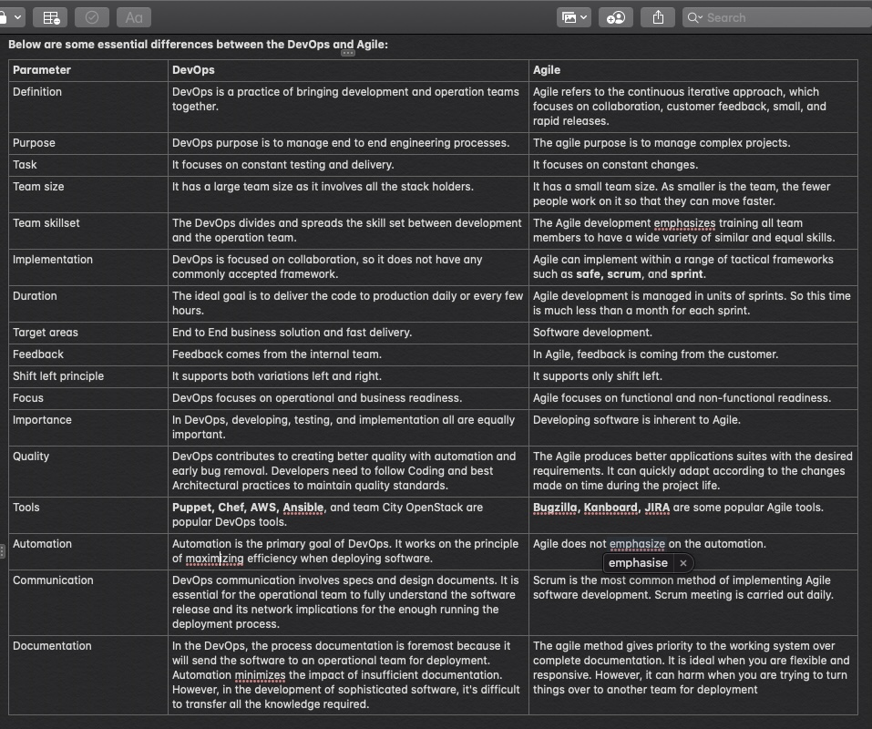

# Day 4

Micheal succinctly explained the difference between agile and DevOps.

Let me start by defining both terms

 DevOps is a practice of bringing development and operations teams together. More to this, he explained that DevOps usually describes software development and delivery practices based on cooperation between software developers and operations specialists the main DevOps benefits are delivering a simplified development process and minimizing miscommunication

## Agile is an iterative approach that focuses on collaboration, customer feedback, and small rapid releases

* He elucidates saying Agile is an approach that focuses on delivering small results faster rather than releasing one big interaction of the product software is developed in iterations the team releases a new version every week or month with non-incremental updates the final goal of agile is to deliver an optimal experience to the end-users

```json

 DevOps focuses on constant testing and delivery while  the Agile process focuses on constant changes

 ```



Bring it all together... a good idea or not? Discuss? (I had to copy this directly from his note 🙈🙊)

The combination of Agile and DevOps brings the following benefits you get

  Flexible management and powerful technology

  Agile practices help DevOps teams to communicate their priorities more efficiently

  The automation cost that you have to pay for your DevOps practices are justified by your agile requirement of deploying quickly and frequently

  It leads to strengthening the team adopting agile practices will improve collaboration increase the team's motivation and decrease employee turnover rates
  As a result, you get better product quality
